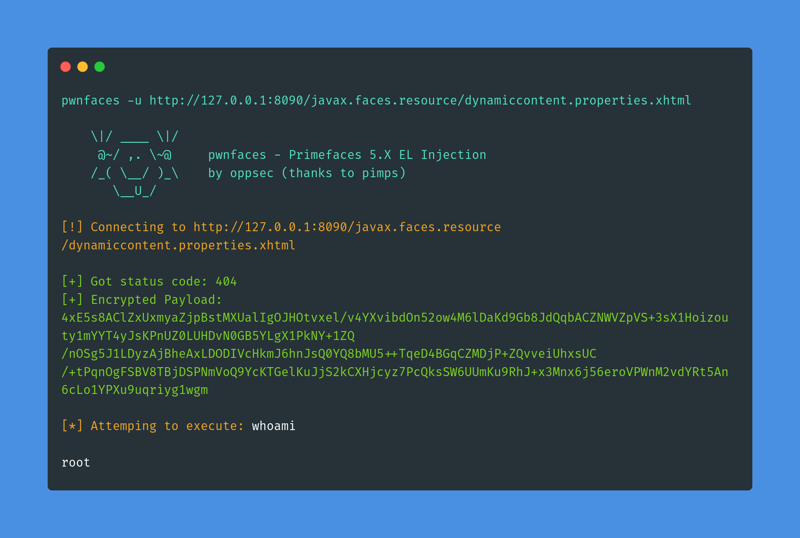

# 😛 pwnfaces
> Primefaces 5.X EL Injection Exploit

<div align="center">
    
</div>

<p align="center">
    
    
    
    
    
</p>

___

<br>

### 🕵️ What is pwnfaces?
🕵️ **pwnfaces** is a Golang tool created to exploit the vulnerability defined as CVE-2017-1000486 (EL Injection in PrimeFaces 5.X)

<br>

### ⚡ Installing / Getting started

A quick guide of how to install and use pwnfaces.

```shell
1. go install github.com/oppsec/pwnfaces
2. pwnfaces -u http://127.0.0.1:8090/javax.faces.resource/dynamiccontent.properties.xhtml
```

You can use `go install github.com/oppsec/pwnfaces@latest` to update the tool

<br><br>

### ⚙️ Pre-requisites
- [Golang](https://go.dev/dl/) installed on your machine.

<br><br>

### ✨ Features
- Extremely fast
- Low RAM and CPU usage
- Made in Golang

<br><br>

### 🔨 Contributing

A quick guide of how to contribute with the project.

```shell
1. Create a fork from pwnfaces repository.
2. Download the project with git clone https://github.com/your/pwnfaces.git
3. cd pwnfaces/
4. Make your changes.
5. Commit and make a git push.
6. Open a pull request.
```

<br><br>

### ⚠️ Warning
- The developer is not responsible for any malicious use of this tool.